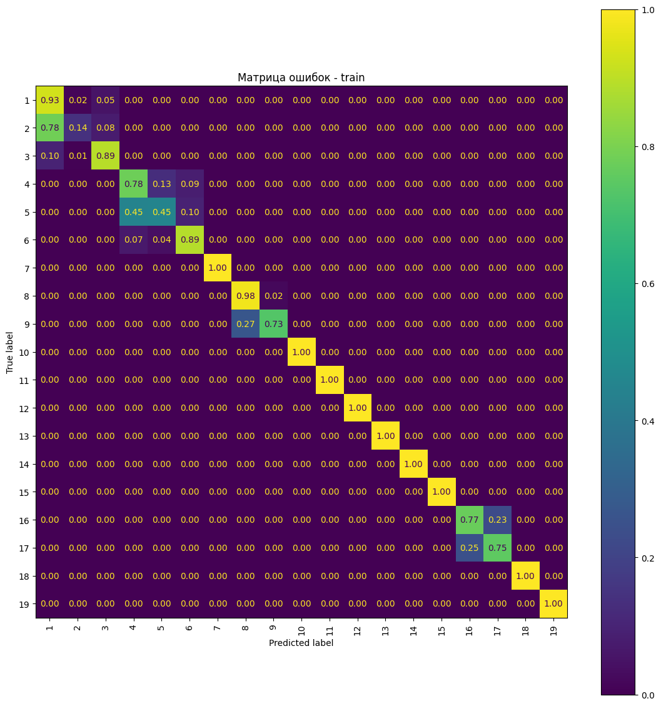
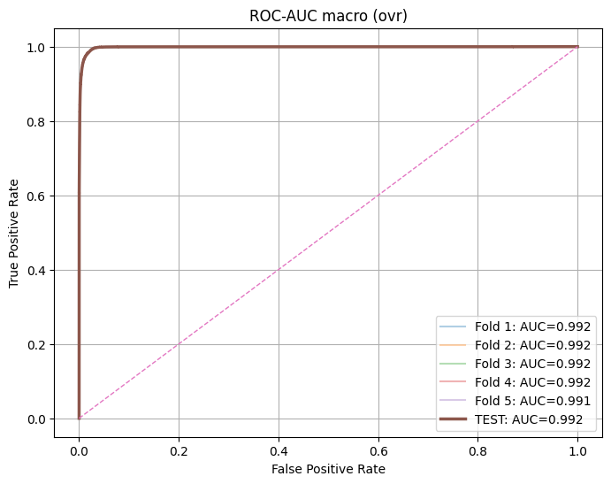
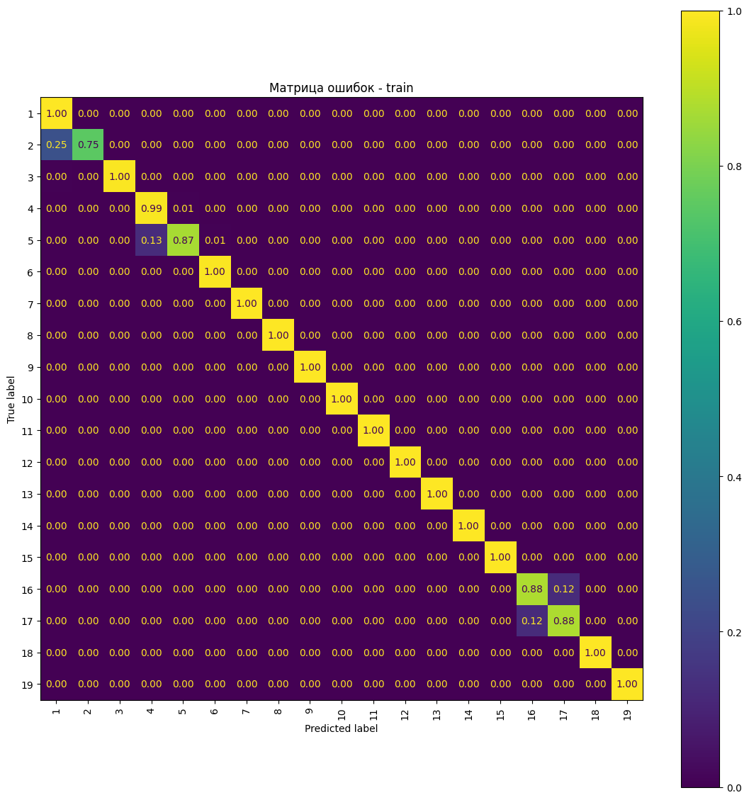
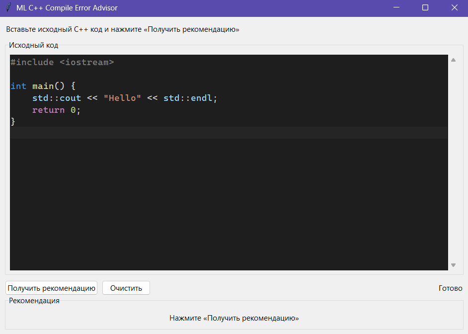

# Рекомендательная система по исправлению ошибок компиляции C++

## Оглавление
- [Постановка задачи](#постановка-задачи)
- [Используемые программные средства и библиотеки](#используемые-программные-средства-и-библиотеки)
- [Описание датасета](#описание-датасета)
- [Преобразование датасета](#преобразование-датасета)
  - [Парсинг датасета](#парсинг-датасета)
  - [Разметка датасета](#разметка-датасета)
  - [Ручная токенизация](#ручная-токенизация)
- [Обучение моделей](#обучение-моделей)
- [Результаты обучения моделей](#результаты-обучения-моделей)
  - [Первая модель](#первая-модель)
  - [Вторая модель](#вторая-модель)
- [Описание функционала приложения](#описание-функционала-приложения)

## Постановка задачи

Необходимо разработать оконное приложение, которое работает на основе алгоритмов машинного обучения, определяет первую найденную ошибку компиляции и номер строки исходного кода на языке `C++`, где возникает данная ошибка, и выдаёт текстовую рекомендацию по её исправлению.

На вход приложения подаётся исходный код программы на `C++`, на выходе возвращается текстовая рекомендация по исправлению найденной ошибки.

Первую по порядку ошибку в исходном коде можно находить с помощью различных `C++` компиляторов, используя разные версии стандарта `C++`. В нашей работе мы ограничимся использованием компилятором `MSVC (Visual Studio 2022)` с версией `C++14`.

При разработке приложения рассматривались следующие коды ошибок: `C2065`, `C3861`, `C2143`, `C2146`, `C2059`, `C1075`, `C1083`, `C2131`, `C2440`, `C2446`, `C2676`, `C2678`, `C2679`. Они использовались для группировки рекомендаций.

## Используемые программные средства и библиотеки

Программа была реализована на языке `Python`, для хранения обучающих данных и разработанных моделей использовалась база данных `SQLite3`. Для компиляции исходного кода вызывался компилятор `MSVC` через консоль `Developer Command Prompt for VS 2022` с помощью библиотеки `subprocess`, для парсинга исходного кода применялась библиотека `libclang`.

Для обработки датасета и последующего хранения данных использовались библиотеки `pandas`, `numpy`, `concurrent` и `pyarrow`. Для предобработки данных и обучения моделей применялась библиотека `sklearn`, для визуализации результатов классификации использовалась `matplotlib` и для сохранения и загрузки моделей применялась `joblib`.

Оконное приложение разрабатывалось с помощью библиотеки `tkinter`, использовалась среда разработки `VS Code`, процесс обучения моделей происходил на платформе `Google Colab`.

## Описание датасета

Построение обучающих данных было основано на датасете `Project CodeNet`, являющимся одним из крупнейших открытых наборов данных программного кода от `IBM`. Он включает примерно 14 миллионов примеров кода для около 4000 задач соревнований по программированию, собранных с онлайн-соревнований систем `AIZU` и `AtCoder`. Датасет охватывает 55 языков программирования, но наиболее широко представлен `C++` (примерно 57% от общего числа). Каждая программа хранится в отдельном исходном файле, а к ней прилагается запись в CSV-метаданных с различной информацией - ID задачи и пользователя, путь к файлу, время, размер кода и статусы компиляции и проверки.

Данный датасет можно найти по ссылке https://github.com/IBM/Project_CodeNet.

Из датасета `CodeNet` были отфильтрованы `C++` программы со статусом `Compile Error`, а также были извлечены исходные коды из файлов по указанным путям к ним, из которых были удалены все комментарии и которые затем были добавлены в качестве нового столбца. Полученный `DataFrame` был сохранён в формате `parquet`.

## Преобразование датасета

Каждая `C++` программа, код которой содержался в отдельной записи датасета, была откомпилирована и в результате были добавлены новые столбцы с текстом ошибки компиляции и номером строки, в которой была обнаружена ошибка.

Было посчитано количество программ с одинаковыми кодами ошибок и были рассмотрены первые 13 кодов в отсортированном списке по убыванию количеству примеров. Далее рассматривалась только часть датасета с указанными ранее кодами ошибок.

Датасет был разделён на две части - программы, в которых использовались макросы, и программы без макросов. Разделение было необходимо для ускорения парсинга программ, т. к. часть датасета без макросов была значительно больше и в параметрах метода `parse`, содержащегося в библиотеке `libclang`, можно отключить опции для обработки макросов, что ускоряет процесс парсинга.

### Парсинг датасета

Для каждого исходного кода программы сначала вызывалась функция `find_smallest_cursor_by_line`, которая находила наиболее локальный `Cursor` (указатель на узел семантического дерева (`AST`-дерева), например, объявление, выражение, оператор, тип, директива `include` и т. п.) в строке с ошибкой компиляции, после этого извлекались `core_info`, в которой хранятся вид узла, название в коде, тип данных, и `cursor_meta`, в которой содержатся метаданные узла, и находилась `parent_chain`, представляющая собой цепочку из видов узлов родительских `Cursor`'ов с глубиной вложенности 6.

Далее строился и нормализовывался список `local_tokens_norm` из `Token`'ов (лексических единиц), рассматриваемых в окрестности строки с ошибкой с радиусом 2-4 строк, и синтезировались глобальные признаки, состоящие из `include`, макросов, псевдонимов типа и различных счётчиков.

Результаты парсинга датасета с соответствующим индексом записи `DataFrame` сохранялись в формате `jsonl` для возможности объединения датасета с полученным `jsonl` файлом.

### Разметка датасета

Для рассматриваемых кодов ошибок были составлены рекомендации по исправлению ошибок компиляции с данными кодами, при этом одному и тому же коду ошибки может соответствовать несколько различных рекомендаций. Была сделана сортировка рекомендаций по исправлению ошибок с одним и тем же кодом по частоте соответствующих ошибок в датасете. Отсортированные рекомендации были сохранены в базу данных.

По умолчанию в датасете в качестве нового столбца устанавливалась метка, соответствующая рекомендации по исправлению наиболее встречающихся ошибок с данным кодом. Дальнейшее уточнение разметки датасета производилось с помощью `label functions` (`lf`), каждая из которых соответствует определённой рекомендации и представляет собой эвристическую функцию, которая автоматически проставляет метки записям в датасете на основе текста ошибки и исходного кода, когда ручная разметка трудоёмка или невозможна в нужном объёме.

### Ручная токенизация

Полученный компиляцией `error_text`, содержащий код и описание ошибки, нормализовывался, заменяя ключевые слова на шаблоны, и токенизировался, разделяя слова по пробелам и удаляя знаки препинания.

Из полученных парсингом `core_info`, `cursor_meta`, `parent_chain`, `local_tokens_norm` и глобальных признаков строились текстовые и числовые признаки, используемые для дальнейшей векторизации, при этом текстовые признаки токенизировались без помощи библиотек.

Эти токены и числовые признаки были добавлены в размеченный датасет в качестве новых столбцов и полученные обучающие данные сохранялись в базу данных.

## Обучение моделей

Среди моделей машинного обучения рассматривались:
1. модель стохастического градиентного спуска с логистической функцией потерь;
2. модель `K`-ближайших соседей с метрикой косинусного сходства.
    
Для числовых признаков использовался векторизатор `DictVectorizer` с методом стандартизации `StandardScaler`, а для текстовых признаков применялся `TfidfVectorizer` с методом стандартизации `MaxAbsScaler`. В качестве подхода к обучению использовалась кросс-валидация `StratifiedKFold` с разбиением на 5 частей, для подбора гиперпараметров моделей применялся `HalvingGridSearchCV`.

Для декларативного описания параметров векторизаторов и кросс-валидации и гиперпараметров моделей в `sklearn` использовался файл `default.yaml`.

Весь процесс обучения моделей был организован в одном `Pipeline`, в котором содержатся рассматриваемые векторизатор и оцениватель.

В качестве метрик использовались `precision`, `recall`, `f1-score`, `accuracy`, `roc-auc`, а также строилась матрица ошибок.

Для первой модели были выбраны следующие лучшие параметры:
```yaml
    loss: log_loss
    tol: 0.001
    n_iter_no_change: 5
    learning_rate: optimal
    average: true
    alpha: 0.001
    class_weight: balanced
    max_iter: 800
    penalty: l2
```
Для второй модели были выбраны следующие лучшие параметры:
```yaml
    metric: cosine
    algorithm: brute
    n_neighbors: 15
    weights: distance
```
## Результаты обучения моделей

### Первая модель
Оценка точности для обучающей выборки приведена на следующем фрагменте: 
```
              precision    recall  f1-score   support

           1       0.89      0.93      0.91     40213
           2       0.45      0.13      0.20      4529
           3       0.79      0.89      0.84     10169
           4       0.70      0.76      0.73      5148
           5       0.52      0.44      0.48      2721
           6       0.88      0.88      0.88      6100
           7       1.00      1.00      1.00     20583
           8       0.98      0.98      0.98      8004
           9       0.55      0.67      0.60       400
          10       1.00      1.00      1.00     15453
          11       1.00      1.00      1.00      8687
          12       1.00      1.00      1.00     11782
          13       1.00      1.00      1.00     15432
          14       1.00      1.00      1.00      2652
          15       1.00      1.00      1.00      2189
          16       0.70      0.70      0.70      1256
          17       0.74      0.76      0.75      1508
          18       1.00      1.00      1.00      5799
          19       1.00      1.00      1.00      2666

    accuracy                           0.92    165291
   macro avg       0.85      0.85      0.85    165291
weighted avg       0.92      0.92      0.92    165291
```

Оценка точности для тестовой выборки:
```
              precision    recall  f1-score   support

           1       0.89      0.93      0.91      7097
           2       0.46      0.11      0.18       799
           3       0.79      0.91      0.85      1795
           4       0.67      0.77      0.72       908
           5       0.51      0.40      0.44       480
           6       0.89      0.87      0.88      1077
           7       1.00      1.00      1.00      3633
           8       0.99      0.98      0.99      1413
           9       0.70      0.77      0.73        71
          10       1.00      1.00      1.00      2727
          11       1.00      1.00      1.00      1533
          12       1.00      1.00      1.00      2079
          13       1.00      1.00      1.00      2723
          14       1.00      1.00      1.00       468
          15       1.00      1.00      1.00       386
          16       0.69      0.74      0.72       222
          17       0.77      0.74      0.76       266
          18       1.00      1.00      1.00      1023
          19       1.00      1.00      1.00       470

    accuracy                           0.93     29170
   macro avg       0.86      0.85      0.85     29170
weighted avg       0.92      0.93      0.92     29170
```

Матрица ошибок модели для обучающей выборки:


Матрица ошибок модели для тестовой выборки:


По полученным результатам можно увидеть, что модель справляется хуже всего с классификацией 2-го, 5-го, 9-го и 17-го классов, ошибочно классифицируя экземпляры в соседние классы. Предположительно это связано с тем, что рекомендации, соответствующие данным классам и их соседям, относятся к одним тем же кодам ошибок компиляции.

`ROC`-кривые на всех 5 `Fold`'ах обучающей выборки и тестовой выборки целиком со способом усреднения `macro` выглядят следующим образом:


`ROC`-кривые со способом усреднения `micro`:


В среднем модель даёт хорошие показатели оценок качества моделей

### Вторая модель

Оценка точности для обучающей выборки приведена на следующем фрагменте: 
```
              precision    recall  f1-score   support

           1       0.88      0.96      0.92     40213
           2       0.62      0.19      0.30      4529
           3       0.87      0.88      0.87     10169
           4       0.74      0.74      0.74      5148
           5       0.64      0.49      0.55      2721
           6       0.87      0.95      0.90      6100
           7       0.99      0.99      0.99     20583
           8       0.98      0.98      0.98      8004
           9       0.77      0.61      0.68       400
          10       0.99      0.98      0.98     15453
          11       1.00      0.99      0.99      8687
          12       0.99      0.99      0.99     11782
          13       0.99      0.99      0.99     15432
          14       0.99      0.96      0.98      2652
          15       1.00      0.99      0.99      2189
          16       0.75      0.72      0.73      1256
          17       0.78      0.78      0.78      1508
          18       1.00      0.99      1.00      5799
          19       1.00      0.99      1.00      2666

    accuracy                           0.93    165291
   macro avg       0.89      0.85      0.86    165291
weighted avg       0.92      0.93      0.92    165291
```

Оценка точности для тестовой выборки:
```
              precision    recall  f1-score   support

           1       0.89      0.96      0.92      7097
           2       0.67      0.23      0.34       799
           3       0.87      0.90      0.89      1795
           4       0.73      0.78      0.75       908
           5       0.68      0.47      0.55       480
           6       0.87      0.95      0.91      1077
           7       1.00      0.99      0.99      3633
           8       0.98      0.99      0.98      1413
           9       0.90      0.65      0.75        71
          10       0.99      0.98      0.98      2727
          11       1.00      0.99      1.00      1533
          12       0.99      0.99      0.99      2079
          13       0.99      1.00      0.99      2723
          14       0.98      0.95      0.97       468
          15       1.00      0.99      1.00       386
          16       0.72      0.66      0.69       222
          17       0.73      0.75      0.74       266
          18       1.00      1.00      1.00      1023
          19       1.00      1.00      1.00       470

    accuracy                           0.93     29170
   macro avg       0.89      0.85      0.87     29170
weighted avg       0.93      0.93      0.93     29170
```

Матрица ошибок модели для обучающей выборки:


Матрица ошибок модели для тестовой выборки:


В данной модели также можно заменить, что метки, относящиеся к одним и тем же кодам ошибки, плохо классифицируются, что подтверждает наше ранее выдвинутое предположение.

`ROC`-кривые на всех 5 `Fold`'ах обучающей выборки и тестовой выборки целиком со способом усреднения `macro` выглядят следующим образом:


`ROC`-кривые со способом усреднения `micro`:


В среднем модель даёт хорошие показатели оценок качества моделей

## Описание функционала приложения

Оконное приложение состоит из текстового поля с возможностью прокрутки, куда вставляется исходной код программы, кнопок `Получить рекомендацию` и `Очистить` и поля вывода, в котором отображается текстовая рекомендация по исправлению найденной ошибки.

Интерфейс приложения для разработанной рекомендательной системы по исправлению ошибок компиляции C++ представлен на следующем рисунке.


После нажатия на кнопку `Получить рекомендацию` запускается компиляция и извлекаются описание ошибки и номер строки с ошибкой. Если не была найдена ошибка, то запуск модели не происходит и выводится сообщение об отсутствии ошибок компиляции, в противном случае вычисляются текстовые и числовые признаки, которые нормализуются, токенизируются и далее подаются на вход рассматриваемой модели. В результате классификации определяется метка рекомендации, которая выступает в качестве `id` записи в таблице рекомендаций в базе данных. Из неё извлекается соответствующая текстовая рекомендация и отображается в поле вывода приложения.